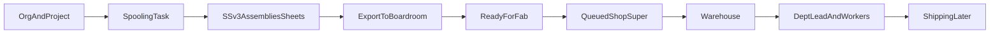

# Order of Operations — BIM Boardroom + SSv3 + Fab

End-to-end operator sequence from Boardroom setup through shop Fab. Use this when the system feels big; the process itself is linear.

**Contents:** Part A (main nav dashboards) · Part B (project boards) · Part C (SSv3 → Fab) · **Part D (job levels & permissions — every detail)**

## Prerequisites

- **BIM Boardroom** running in Electron (`npm run electron:dev` or installed build) so the local API publishes projects/tasks.
- **Revit** with **Spooling Savant V3 (Exports)** loaded (SS Manager V3).
- Default export folder:  
  `Spooling Savant Version 3 (Exports)/Boardroom/Exports`

---

## Part A — Dashboards (main nav)

Nav tabs come from `MainNav.tsx`. Who sees a gated tab is controlled by permissions (`permissions.ts`) plus Owner auto-grants. Dashboard **roles** (Shop Super, Warehouse Lead, etc.) are assigned on **Employees** and shape *what you see inside* Fab / PM / Field / Shipping — they are not the same as the tab permission.

### Quick map

| Nav label | Tab id | Who sees the tab | What it is |
|-----------|--------|------------------|------------|
| Owner Dashboard | `owner-dashboard` | `view-owner-dashboard` / Owner | Portfolio health |
| PM Dashboard | `pm-dashboard` | `view-pm-dashboard` | PM’s projects + PM board tasks |
| Clients | `clients` | Everyone | Main Dashboard + all project boards |
| Task Board | `task-board` | Everyone | Detailer / Support kanban |
| Fab Workstation | `fab-dashboard` | `view-fab-dashboard` | Queued / Warehouse / personal shop views |
| Shipping Dashboard | `shipping-dashboard` | `view-shipping-dashboard` | Shipping board task list |
| Field Dashboard | `field-dashboard` | `view-field-dashboard` | Field board task list |
| Time Tracking | `time-tracking` | `view-time-tracking` (default on for all job levels) | Hours calendar + Fab clocks |
| Employees | `employees` | Everyone (edit needs `manage-org`) | Roster, permissions, dashboard roles |
| Organizational Chart | `org-chart` | `view-org-chart` or `manage-org` | Reporting tree |
| Activity Log | `activity-log` | `view-activity-log` or Owner/BIM/Ops Mgr | Audit trail |
| Access Control | `visibility-dashboard` | Job-level setting (default Owner/BIM/Ops Mgr) or `view-visibility-dashboard` | Permissions + nav visibility matrix |

---

### A1. Owner Dashboard

- **Purpose:** Executive portfolio view — how all projects are doing at a glance.
- **Who:** Owners (`view-owner-dashboard` / owner org category). BIM Manager does **not** get this by default.
- **Shows:** Active project count, average progress, budget vs spent, at-risk signals, BIM lifecycle stage rollup, full project list.
- **Actions:** Open a project into Clients → Main Overview. Read-only metrics.
- **Sub-modes:** None.
- **Linked boards:** Opens into Clients → Main Overview for a project.

---

### A2. PM Dashboard

- **Purpose:** Project Managers’ home for *their* jobs (or all projects if `manage-org`).
- **Who:** `view-pm-dashboard` — Owner; BIM / Ops / Support Manager defaults; seeded PMs.
- **Dashboard roles:** Project Managers, Assistant PMs (assigned on Employees).
- **Shows:** Project cards (budget, schedule, lifecycle %), PM board task list, lifecycle legend.
- **Actions:** Open **Project Management** board for a project; **Assign PM** (if `manage-org`).
- **Linked board:** `project-managers` under Clients → project.
- **Sub-modes:** None.

---

### A3. Clients (entry to all project boards)

- **Purpose:** Create clients/projects and do day-to-day spreadsheet board work.
- **Who:** Everyone signed in.
- **Sub-modes:**
  1. **Main Dashboard** (logo) — portfolio cards by client; click into a project.
  2. **Board mode** — strips: **Clients** → **Projects** → **Boards**.
- **What lives here:** Every project board (see **Part B**). This is the spreadsheet home for BIM work; Fab shop day-to-day is usually **Fab Workstation**, not the Fab spreadsheet tab.
- **Actions:** Add/rename clients & projects; open/reorder boards; create/edit tasks; project settings / teams / job code.

---

### A4. Task Board

- **Purpose:** Office kanban of work assigned to people (not the project board grid).
- **Who:** Everyone.
- **Sub-modes:** **Detailers** | **Support Specialists**.
- **Shows:** Unassigned pool + one column per employee on that board.
- **Actions:** Drag tasks onto people; reorder by priority/due date; Task Board status visibility settings.
- **Related boards:** Surfaces tasks from Detailers / Deliverables / Spooling workflows that are assigned to those people.

---

### A5. Fab Workstation (shop)

- **Purpose:** Working station for SSv3 packages after **Ready for Fab** — packages, assemblies, export files, BOM, weld log, clock, photos/comments.
- **Who (tab):** `view-fab-dashboard` — Owner; BIM / Ops / Support Manager; seeded Fab staff.
- **Dashboard roles:** Shop Super, Warehouse Lead, Warehouse Worker, Shop Dept Manager (Mech / Plmb / HVAC), Workers.
- **Dashboards strip** (Queued / Warehouse / named people): Shop Super, Warehouse Lead, Owner, and org-chart managers **upstream** of Shop Super or Warehouse Lead.
- **Linked board:** Fabrication (`fab`) — same tasks; Workstation is the shop UI.

#### A5a. Queued Dashboard

- **Default for:** Shop Super, Owner (queue browse).
- **Shows:** All Fab packages (project filter if set).
- **Actions:** Review packages; **assign Dept Lead** only; open detail / files; photos/comments.
- **Not here:** Worker assign; package clock; warehouse-only BOM focus.

#### A5b. Warehouse Dashboard

- **Default for:** Warehouse Lead, Warehouse Worker.
- **Also via strip:** Shop Super, Owner, upstream managers.
- **Shows:** Packages in **Queued** or **Pulling Material** only.
- **Actions:** Open **Bill of Materials** PDF; status Queued → Pulling Material → Material Pulled; **Clock in/out**; photos/comments.
- **Gate:** After **Material Pulled**, package leaves the warehouse list.

#### A5c. Personal workstations (Dept Lead / Worker)

- **Default for:** Shop Dept Managers and Fab Workers (filtered to assignments).
- **Strip:** One pill per person (name + role), excluding Shop Super / Warehouse Lead.
- **Dept Lead:** Packages where they are Dept Lead; assign package and/or assemblies to workers; advance work; photos/comments; clock.
- **Worker:** Assigned packages/assemblies; sheet viewer; weld-log tap-fill; status progression; photos/comments; clock.
- **Typical status after material:** In Fab (Mech/Plmb/HVAC) → QA Review → Rework (optional) → Ready to Ship → Complete.

#### Fab shared tools

- Sheet / PDF viewer (assemblies, Spools Combined, export files).
- Interactive **Weld Log** (tap Date / Welder ID / Initials).
- **Photos** / **Comments** on the package.
- **Acting as** / View-as when the full strip is not shown.

---

### A6. Shipping Dashboard

- **Purpose:** Department view of **Shipping** board tasks.
- **Who:** `view-shipping-dashboard` — Owner; BIM / Ops / Support Manager; seeded Shipping staff.
- **Dashboard roles:** Shipping Manager, Workers.
- **Shows:** Task table (number, title, project, status).
- **Actions:** Review status here; create/edit on Clients → **Shipping** board.
- **Gap:** Fab **Ready to Ship** does **not** auto-promote into Shipping yet.
- **Sub-modes:** None.

---

### A7. Field Dashboard

- **Purpose:** Department view of **Field** board tasks (site install).
- **Who:** `view-field-dashboard` — Owner; BIM / Ops / Support Manager; seeded Field staff (PMs often get Field too).
- **Dashboard roles:** Site Superintendents, Foremen, Crew Leads.
- **Shows:** Field board task table.
- **Actions:** Review progress; staffing via Employees → Field roles; task work on Clients → **Field** board.
- **Sub-modes:** None.

---

### A8. Time Tracking

- **Purpose:** Log and review hours (office + Fab package clocks).
- **Who (tab):** Everyone. **Visible entries:** yourself; people who report to you; Owners see all.
- **Shows:** Entry form, Quick Tasks, calendar (**day / week / month**), **Clocked in** strip for open Fab clocks.
- **Actions:** Add/edit/delete completed entries (15-minute grid); clock out open Fab entries; pick employee if allowed.
- **Fab link:** Warehouse / personal **Clock in/out** writes time entries with package `taskId` / client / project.

---

### A9. Employees

- **Purpose:** Roster, permissions, and **dashboard role** assignments.
- **Who:** Everyone can open. **Edit:** `manage-org` (Owner, BIM Manager, Ops Manager defaults).
- **Stages:** Leadership | Detailers | Support | Project Management | Field | Fab Shop | Shipping.
- **Actions:** Invite/add; org category / trade; Works Under; permission chips; assign PM / Field / Fab / Shipping roles (incl. Warehouse Lead / Workers).
- **Fab setup:** Assign Shop Super, Warehouse Lead + Workers, Dept Managers, Workers here before shop work.

---

### A10. Organizational Chart

- **Purpose:** Visual reporting tree.
- **Who:** `view-org-chart` or `manage-org` (edit needs manage-org).
- **Actions:** Pan/zoom; with `manage-org`, drag people under managers.
- **Fab note:** Warehouse Dashboard strip also opens for managers **upstream** of Shop Super or Warehouse Lead.

---

### A11. Activity Log

- **Purpose:** Audit trail (creates, updates, deletes, status/column changes).
- **Who:** `view-activity-log` or Owner / BIM Manager / Ops Manager.
- **Actions:** Filter / search; restore deleted columns if `manage-columns`.

---

### Related UI (not main nav)

| UI | Where | Notes |
|----|--------|------|
| Reports | Header | Dialog; scope follows active area |
| View As | Header | Switch perspective (incl. Fab roster) |
| Login | Pre-auth | Sign-in before any dashboard |

---

## Part B — Project boards (Clients → board mode)

Under a project, the board strip is: **Main Overview** first, then sub-boards (reorderable), then any **custom** boards.

**Default sub-board order:** Project Management → RFI → Documents → Detailers → Deliverables → Spooling → Fabrication → Shipping → Field.

### Main Overview vs sub-boards

| | **Main Overview** | **Sub-boards** |
|--|--|--|
| **Layout** | All project tasks under **section** groups | One board’s tasks (mirrors that section’s hierarchy; RFI/Documents are flat) |
| **Default sections** | PM, RFI, Documents, Detailers, Deliverables, Spooling (+ custom). **Not** Fab / Shipping / Field by default | Own tab |
| **Columns** | Union of section columns + trailing **Board** column | Board-local; no Board column |
| **Statuses** | Per section branch (that board’s workflow) | That board’s status list |
| **Trade/level groups** | On Detailers / Deliverables / Spooling sections | Same hierarchy on those ghost boards |

---

### B1. Main Overview (`main`)

- **Purpose:** Project rollup — see the full BIM path without switching tabs.
- **Who:** Everyone on the job (coordination view).
- **Default statuses (fallback only):** Not Started → Not Ready → Ready → In Progress → On Hold → Complete. Rows under a section use **that section’s** statuses.
- **Special:** Always-expanded sections; shared custom columns with several sub-boards; workflow due-date columns on detailing/spool/fab/shipping/field branches.
- **Actions:** Create/edit tasks in any section; filter/sort; jump awareness of which board a row belongs to via the Board column.

---

### B2. Project Management (`project-managers`)

- **Purpose:** Project setup & coordination — contract through clash/IFC readiness.
- **Who:** PMs / Assistant PMs; linked from **PM Dashboard**.
- **Default statuses:**
  1. Not Started  
  2. Contract Review  
  3. Kickoff Complete  
  4. BEP Approved  
  5. Model Setup  
  6. Clash Cycle Active  
  7. Clashes Resolved  
  8. IFC Ready  
  9. On Hold  
  10. Complete  
- **Special:** Template **PM checklist** groups/tasks; Main Overview section; fixed Due Date (not the shared workflow due-date pack); no status auto-assign teams.
- **Actions:** Run kickoff/BEP/clash checklist work; assign PMs from dashboard when allowed.

---

### B3. RFI (`rfi`)

- **Purpose:** Track RFIs waiting on response vs closed.
- **Who:** Support specialists (assignee pool = project support); PMs/detailers watch via Overview.
- **Default statuses (locked list — only these two ids):**
  1. Waiting for Response  
  2. Complete  
- **Special:** **Flat board** — default columns mainly title + status (no assignee/due/duration); Main Overview section; new tasks default to Waiting for Response. Status list cannot be expanded beyond those two ids (label/color only).
- **Actions:** Log RFIs; mark complete when answered.

---

### B4. Documents (`documents`)

- **Purpose:** Background & reference documents — request → receive → link to model → verify.
- **Who:** Support specialists (assignee pool = project support).
- **Default statuses:**
  1. Not Started  
  2. Requested  
  3. Received  
  4. Linked to Model  
  5. Verified  
  6. On Hold  
  7. Complete  
- **Special:** **Flat board** — very minimal columns (title-focused); Main Overview section; no workflow due-date pack; no auto-assign.
- **Actions:** Track document intake and model linkage.

---

### B5. Detailers (`detailers`)

- **Purpose:** 3D detailing / modeling through hangers, detailer QA, ready for coordination.
- **Who:** Detailers (assignee pool = project detailers). Also on **Task Board → Detailers**.
- **Default statuses:**
  1. Not Started  
  2. Backgrounds Linked  
  3. Modeling (LOD 300)  
  4. Hangers & Supports  
  5. Detailer QA  
  6. Ready for Coordination  
  7. Rework  
  8. On Hold  
  9. Complete  
- **Special:** Main Overview section; **trade-first** level/trade grouping (with Deliverables/Spooling); workflow due-date columns; shared Main custom columns.
- **Actions:** Model, QA, hand off toward coordination / deliverables.

---

### B6. Deliverables (`deliverables`)

- **Purpose:** Support Specialists pipeline — pre-planning through spool prep, with detailer handoffs.
- **Who:** Support (primary) + detailers on handoff statuses. **Task Board → Support Specialists**.
- **Default statuses (auto-assign team):**
  1. Not Started → detailers  
  2. Ready for Pre-Planning → support  
  3. Pre-Planning Complete → support  
  4. Support In Progress → support  
  5. Ready for Spooling → support  
  6. Spool In Progress → support  
  7. Spool QA Review → support  
  8. Spool Approved → support  
  9. Ready for Fab → detailers  
  10. On Hold → detailers  
  11. Detailer Review → detailers  
  12. Fix Mark Ups → support  
  13. Complete → detailers  
- **Special:** Status **auto-assign** to project detailer/support teams; assignees can be locked for overrides; trade-first groups; workflow due dates. **`Ready for Fab` on Deliverables does not promote to Fab** — promotion is **Spooling + SSv3** only.
- **Actions:** Pre-plan, support modeling, spool prep handoffs, mark-up loops.

---

### B7. Spooling (`spooling`)

- **Purpose:** Spool sheet creation, QA, approval, and the **fab-ready gate**.
- **Who:** Support / spoolers; detailers at Ready for Fab.
- **Default statuses (auto-assign team):**
  1. Not Started → support  
  2. Ready for Spooling → support  
  3. Spool In Progress → support  
  4. Spool QA Review → support  
  5. Spool Approved → support  
  6. Ready for Fab → detailers  
  7. On Hold → support  
  8. Complete → support  
- **Special:**
  - **SSv3 export attach** — `boardroom-package.json` + reports land on the Spooling task (folder watch / import).
  - Setting status to **Ready for Fab** with an SSv3 export **promotes** the package tree to the **Fab** board as **Queued**.
  - After Ready for Fab / on Fab, wipe/replace of that export is **blocked**.
  - Main Overview section; trade-first; workflow due dates.
- **Actions:** Run SSv3; attach export; QA sheets; flip **Ready for Fab** when shop should see it.
- **Keep Boardroom open** while SSv3 loads projects/tasks from `http://127.0.0.1:17321`.

---

### B8. Fabrication (`fab`)

- **Purpose:** Shop fabrication after promote — warehouse pull through dept fab, QA, ready to ship.
- **Who:** Fab shop (Shop Super, Warehouse, Dept Managers, Workers). Day-to-day UI is **Fab Workstation**; this tab is the Clients spreadsheet of the same tasks.
- **Default statuses:**
  1. Not Started  
  2. Queued  
  3. Pulling Material  
  4. Material Pulled  
  5. In Fab (Mech)  
  6. In Fab (Plmb)  
  7. In Fab (HVAC)  
  8. QA Review  
  9. Rework  
  10. Ready to Ship  
  11. Complete  
- **Special:** No default Main Overview section; receives SSv3 package/assembly trees on promote; warehouse filters Queued / Pulling Material; package custom fields (`ssv3*`); weld log / clock live in Fab Workstation. **Ready to Ship does not auto-create Shipping tasks.**
- **Actions:** Prefer Fab Workstation for assign, BOM, clock, sheets, weld log, photos/comments.

---

### B9. Shipping (`shipping`)

- **Purpose:** Staging → loading → transit → site delivery → field receipt.
- **Who:** Shipping Manager / Shipping workers (**Shipping Dashboard**).
- **Default statuses:**
  1. Not Started  
  2. Staging  
  3. Loading  
  4. In Transit  
  5. Delivered to Site  
  6. Received by Field  
  7. Complete  
- **Special:** No default Main Overview section; workflow due dates; listed on Shipping Dashboard. No auto-promote from Fab yet.
- **Actions:** Create/advance shipping tasks; track delivery to field.

---

### B10. Field (`field`)

- **Purpose:** Site install — mobilization through punch, as-builts, final inspection.
- **Who:** Site supers, foremen, crew leads (**Field Dashboard**); PMs often watch.
- **Default statuses:**
  1. Not Started  
  2. Mobilization  
  3. Material On Site  
  4. Rough-In  
  5. Hydro / Test  
  6. Trim-Out  
  7. Punch List  
  8. As-Built Update  
  9. Final Inspection  
  10. Complete  
- **Special:** No default Main Overview section; workflow due dates; Field Dashboard lists these tasks.
- **Actions:** Track install progress on site.

---

### B11. Custom boards (`cb-*`)

- **Purpose:** Per-project extra tabs (user-named).
- **Who:** Whatever the team assigns (assignee pool often detailers+support when set).
- **Default statuses:** Generic Main list unless overridden in status settings.
- **Special:** Can appear as a Main Overview section; reorderable with built-ins.
- **Actions:** Same spreadsheet patterns as other hierarchical boards, project-defined workflow.

---

## Part C — Order of operations (SSv3 → Fab)

### 1. Org / roles (Boardroom)

- Log in as Owner / BIM Manager / Ops as needed.
- Maintain **Employees** and **Org Chart**.
- Assign Fab dashboard roles:
  - Shop Super
  - Warehouse Lead + Warehouse Workers
  - Shop Dept Managers (Mech / Plmb / HVAC)
  - Fab Workers
- Optional: set each fab person’s **Welder ID** for weld-log tap-fill.

### 2. Client / project (Boardroom)

- Create **Client** → **Project** (template is fine).
- Confirm job code and project teams.
- Boards that matter for this flow: **Spooling**, **Fab**, **Shipping**.

### 3. Spooling task (Boardroom)

- Create or pick a **Spooling** board task for the package work.
- Assign support / spooler as needed; advance spooling statuses as work proceeds.
- **Keep Boardroom open** for the API.

### 4. SSv3 work (Revit)

- Open **SS Manager V3**.
- Generate Options that affect handoff: Number Welds, Fill Weld Log, Include Weld Log entry fields, title block / weld log layout.
- Create / package assemblies and generate spool sheets.

### 5. Plot / Export to Boardroom (SSv3)

- Plot Packages / Export to Boardroom: pick Boardroom project + Spooling task + export folder.
- Writes `boardroom-package.json` + reports (Spools Combined, BOM, Cut List, Assembly List, Weld Log `.xlsx`, etc.).

### 6. Boardroom ingest

- Electron watches Exports; attaches package/assemblies/files to the Spooling task.
- Re-export can replace until Ready for Fab.

### 7. Ready for Fab (gate)

- Spooling status → **Ready for Fab**.
- Promotes package/assemblies to Fab as **Queued**.
- **Lock:** further SSv3 overwrite blocked.

### 8–10. Shop (Queued → Warehouse → Dept Lead / Workers)

- Queued: assign Dept Lead.
- Warehouse: BOM, clock, Queued → Pulling Material → Material Pulled.
- Personal: assign workers; fab statuses; sheets; weld-log tap-fill; photos/comments.

### 11. Time Tracking

- Package clock in/out → Time Tracking tab.

### 12. Shipping (later)

- Dashboard + board exist; no auto-hand-off from Ready to Ship yet.

---

## Part D — Job levels, permissions & what each person sees

Two separate systems:

1. **Job level (`orgCategory`)** + some `role` rules → default **AppPermissions** → which **main nav tabs** appear.
2. **Dashboard roles** (Employees assigner: Shop Super, Warehouse Lead, PM, etc.) → how Fab/PM/Field/Shipping behave **inside** a tab you already can open.

Permissions can also be edited per person on **Employees** (needs `manage-org`). Runtime auto-grants can still apply even if a chip is missing (see below).

---

### D1. Permission catalog (every permission)

| Permission id | Label in UI | What it unlocks |
|---------------|-------------|-----------------|
| `edit-budget-hours` | Edit budget hours | Edit project budget hours. Also auto-unlocks **View org chart** at runtime. |
| `manage-org` | Manage org & permissions | Edit org chart layout, roster, permission chips, dashboard role assignments; on PM Dashboard see **all** projects + Assign PM. Alone also grants org-chart **access**. |
| `manage-columns` | Manage & restore columns | Delete/manage spreadsheet columns; restore deleted columns from Activity Log. |
| `view-activity-log` | View activity log | **Activity Log** main nav tab. |
| `view-org-chart` | View org chart | **Organizational Chart** main nav tab (browse). Drag/edit still needs `manage-org`. |
| `view-owner-dashboard` | View Owner dashboard | **Owner Dashboard** main nav tab. |
| `view-pm-dashboard` | View PM dashboard | **PM Dashboard** main nav tab. |
| `view-field-dashboard` | View Field dashboard | **Field Dashboard** main nav tab. |
| `view-fab-dashboard` | View Fab dashboard | **Fab Workstation** main nav tab. |
| `view-shipping-dashboard` | View Shipping dashboard | **Shipping Dashboard** main nav tab. |
| `view-visibility-dashboard` | View Access Control | **Access Control** main nav tab (permissions + visibility; also via editable job-level list). |
| `view-time-tracking` | View Time Tracking | **Time Tracking** main nav tab. |

**Always visible (no permission):** Clients, Task Board, Employees.  
**Time Tracking rows** (who you can see): yourself, people who report up to you, or everyone if Owner — separate from the tab permission.

---

### D2. Job levels (`orgCategory`)

| Job level id | Label | Typical `Employee.role` |
|--------------|-------|-------------------------|
| `owner` | Owner | Often support-specialist + owner category (Joe) |
| `bim-manager` | BIM Manager | support-specialist |
| `operations-manager` | Operations Manager | operations |
| `operations-staff` | Operations | operations (PM / Field / Fab / Shipping staff) |
| `plumbing-detailer` | Lead Plumbing Detailer | detailer |
| `mechanical-detailer` | Lead Mechanical Detailer | detailer |
| `sheet-metal-detailer` | Lead Sheet Metal Detailer | detailer |
| `jr-detailer` | Junior Detailer | detailer |
| `support-manager` | Support Specialist Manager | support-specialist |
| `support-specialist` | Support Specialist | support-specialist |

If `orgCategory` is missing: `operations` → `operations-staff`; `support-specialist` → `support-specialist`; else → `plumbing-detailer`.

**Employees UI stages** (lanes, not permissions): Leadership | Detailers | Support | Project Management | Field | Fab Shop | Shipping.

---

### D3. Default permissions by job level

Everyone starts with `view-org-chart`. Then category/role rules add more (`createDefaultEmployeePermissions`).

| Job level | Default permissions |
|-----------|---------------------|
| **Owner** | All 10: Budget, Org, Columns, Activity, Chart, Owner, PM, Field, Fab, Shipping |
| **BIM Manager** | Budget, Org, Columns, Activity, Chart, PM, Field, Fab, Shipping — **not** Owner Dashboard |
| **Operations Manager** | Org, Columns, Activity, Chart, PM, Field, Fab, Shipping — **not** Budget, **not** Owner |
| **Support Manager** | Chart + PM + Field + Fab + Shipping |
| **Detailer** (any trade / junior) | Chart + Budget (`role === 'detailer'`) |
| **Support Specialist** | Chart only |
| **Operations Staff** (generic) | Chart only, **plus** roster extras below if seeded into a department |

#### Operations staff roster extras (`operationsDashboardPermissions`)

| Seeded roster | Example people | Extra view permissions |
|---------------|----------------|------------------------|
| PM | Kendra, Damon | PM + Field + Fab + Shipping |
| Field | Marcus, Elena, Tyler | Field only |
| Fab | Gina…Priya (`emp-fab-1`…`10`) | Fab only |
| Shipping | Harper, Mason | Shipping only |

#### Runtime auto-grants (even if chip missing)

| Permission / gate | Also true when |
|-------------------|----------------|
| Edit budget hours | Detailer role **or** Owner **or** Joe Vasquez |
| View org chart | User can edit budget hours |
| Manage org | Owner **or** Joe Vasquez |
| View Owner dashboard | Owner |
| View PM / Field / Fab / Shipping | Owner |
| Manage columns | Explicit chip **or** Owner / BIM Manager / Ops Manager category |
| View activity log | Explicit chip **or** Owner / BIM Manager / Ops Manager category |
| View someone’s time | Self **or** Owner **or** upstream manager in org chart |

---

### D4. Main nav visibility by job level (defaults)

Always also: **Clients**, **Task Board**, **Employees**.

| Job level | Owner | PM | Fab | Shipping | Field | Time | Org Chart | Activity | Access |
|-----------|:-----:|:--:|:---:|:--------:|:-----:|:----:|:---------:|:--------:|:------:|
| Owner | ✓ | ✓ | ✓ | ✓ | ✓ | ✓ | ✓ | ✓ | ✓ |
| BIM Manager | | ✓ | ✓ | ✓ | ✓ | ✓ | ✓ | ✓ | ✓ |
| Operations Manager | | ✓ | ✓ | ✓ | ✓ | ✓ | ✓ | ✓ | ✓ |
| Support Manager | | ✓ | ✓ | ✓ | ✓ | ✓ | ✓ | | |
| Detailer (any) | | | | | | ✓ | ✓ | | |
| Support Specialist | | | | | | ✓ | ✓ | | |
| Ops – PM Lead | | ✓ | ✓ | ✓ | ✓ | ✓ | ✓ | | |
| Ops – PM Staff | | ✓ | | | | ✓ | ✓ | | |
| Ops – Field Lead | | ✓ | | | ✓ | ✓ | ✓ | | |
| Ops – Field Staff | | | | | ✓ | ✓ | ✓ | | |
| Ops – Fab Lead | | | ✓ | ✓ | | ✓ | ✓ | | |
| Ops – Fab Staff | | | ✓ | | | ✓ | ✓ | | |
| Ops – Shipping Lead | | | ✓ | ✓ | | ✓ | ✓ | | |
| Ops – Shipping Staff | | | | ✓ | | ✓ | ✓ | | |
| Ops – unassigned | | | | | | ✓ | ✓ | | |

**Employees tab:** everyone can open; **editing** people/permissions/roles needs `manage-org` (Owner, BIM Manager, Ops Manager, Joe).

**Access Control** defaults to Owner / BIM Manager / Operations Manager and is editable on that dashboard (job-level checkboxes + Access column). All AppPermissions (Budget, Org, Columns, dashboards, etc.) are managed there — not on Employees.

---

### D5. What each job level sees *inside* each dashboard

#### Owner

| Surface | Detail |
|---------|--------|
| Owner Dashboard | Full portfolio metrics + all projects |
| PM Dashboard | All projects (`manage-org`); Assign PM |
| Clients / boards | Full spreadsheet access for all boards |
| Task Board | Detailers + Support kanban |
| Fab Workstation | Queued by default; **full Dashboards strip** (Queued, Warehouse, every personal tab) |
| Shipping / Field | Full department task lists |
| Time Tracking | **All** employees’ entries |
| Employees | Full edit |
| Org Chart | View + edit |
| Activity Log | Full + restore columns |

#### BIM Manager

| Surface | Detail |
|---------|--------|
| Owner Dashboard | **No tab** |
| PM / Fab / Shipping / Field | Tabs yes; PM shows assigned projects unless also manage-org |
| Fab strip | Yes if upstream of Shop Super / Warehouse Lead in org chart (Ops Manager usually is; BIM Manager depends on reports-to) |
| Time Tracking | Self + reports |
| Employees / Org Chart | Edit (`manage-org`) |
| Activity Log | Yes |

#### Operations Manager

| Surface | Detail |
|---------|--------|
| Same phase dashboards as BIM Manager | PM, Fab, Shipping, Field, Org, Activity |
| Budget hours | **No** by default |
| Owner Dashboard | **No** |
| Fab strip | Yes when upstream of Shop Super / Warehouse Lead (seeded: Shop Super reports to Ops Manager) |
| Employees | Edit |

#### Support Manager

| Surface | Detail |
|---------|--------|
| PM / Fab / Shipping / Field | Tabs yes |
| Owner / Activity | **No** by default |
| Org Chart | View |
| Employees | View; edit only if given `manage-org` |
| Fab inside | Depends on fab **role** assignment + strip rules |

#### Detailer (Plumbing / Mechanical / Sheet Metal / Junior)

| Surface | Detail |
|---------|--------|
| Phase dashboards | **None** by default |
| Clients boards | Full project work — Detailers board primary; Main Overview sections |
| Task Board | Detailers lane |
| Budget hours | Yes |
| Org Chart | View |
| Time Tracking | Self (+ reports if any) |

#### Support Specialist

| Surface | Detail |
|---------|--------|
| Phase dashboards | **None** by default |
| Clients boards | Deliverables / Spooling / Documents / RFI primary |
| Task Board | Support Specialists lane |
| Org Chart | View |

#### Operations – PM staff (e.g. Project Manager / Assistant PM roles)

| Surface | Detail |
|---------|--------|
| Tabs | PM + Field + Fab + Shipping (+ Chart) |
| PM Dashboard | Projects where they are on `pmIds` (or all PM seed staff); not all projects unless `manage-org` |
| Field / Fab / Shipping | Tabs open; Fab mode still depends on fab role (usually none → queue fallback if they open Fab) |
| Dashboard roles | Project Managers / Assistant PMs buckets on Employees |

#### Operations – Field staff

| Surface | Detail |
|---------|--------|
| Tabs | Field (+ Chart) |
| Field Dashboard | All Field-board tasks (no per-role row filter) |
| Roles | Site Superintendent / Foreman / Crew Lead (staffing labels) |

#### Operations – Fab staff

| Surface | Detail |
|---------|--------|
| Tabs | Fab (+ Chart) only by default |
| **Shop Super** | Queued Dashboard; full strip |
| **Warehouse Lead** | Warehouse Dashboard; full strip |
| **Warehouse Worker** | Warehouse mode; **no** full strip |
| **Dept Manager Mech/Plmb/HVAC** | Personal workstation (packages as Dept Lead) |
| **Worker** | Personal workstation (package/assembly assignments) |
| Upstream of Super/Lead | Strip browse including Warehouse / Queued |

#### Operations – Shipping staff

| Surface | Detail |
|---------|--------|
| Tabs | Shipping (+ Chart) |
| Shipping Dashboard | All Shipping-board tasks |
| Roles | Shipping Manager / Workers |

---

### D6. Dashboard roles (Employees assigner) — not the same as job level

Assigned under Employees. They do **not** open the nav tab by themselves (you still need `view-*-dashboard`).

| Dashboard | Role ids / labels |
|-----------|-------------------|
| PM | `project-manager` Project Managers, `assistant-pm` Assistant PMs |
| Field | `site-superintendent`, `foreman`, `crew-lead` |
| Fab | `shop-super`, `warehouse-lead`, `warehouse-worker`, `dept-manager-mech`, `dept-manager-plmb`, `dept-manager-hvac`, `worker` |
| Shipping | `shipping-manager`, `worker` |

#### Fab role → mode (inside Fab Workstation)

Primary role resolution order: Owner → Shop Super → Warehouse Lead → Warehouse Worker → Dept Manager (Mech/Plmb/HVAC) → Worker → else **`owner-queue`** (same as Queued).

| Primary Fab role | Mode | Packages shown |
|------------------|------|----------------|
| Owner / Shop Super / `owner-queue` (no fab role) | Queued | All packages |
| Warehouse Lead / Warehouse Worker | Warehouse | Status **Queued** or **Pulling Material** only |
| Dept managers / Workers | Personal | Packages where user is Dept Lead, package Worker, or assembly assignee |

#### Fab Dashboards strip (who)

| Who | Strip? |
|-----|--------|
| Owner | Yes |
| Shop Super | Yes |
| Warehouse Lead | Yes |
| Anyone whose primary resolves to `owner-queue` (has Fab tab, no fab role) | Yes |
| Upstream manager of Shop Super or Warehouse Lead | Yes |
| Warehouse Worker / Dept Mgr / Worker (primary) | No (Acting-as / own mode only) |

#### Fab in-mode actions

| Action | Who can |
|--------|---------|
| Assign Dept Lead on a package | Queued mode + Shop Super or `owner-queue` |
| Assign Workers / assemblies | Personal mode + you are that package’s Dept Lead |
| Clock in/out on package | Warehouse + personal workstations (feeds Time Tracking) |
| Browse Queued / Warehouse / every personal tab via strip | Strip-eligible users above |

---

### D7. Protected / special people

| Person | Notes |
|--------|------|
| **Joe Vasquez** (`emp-support-1`) | Owner category locked; cannot delete; full Owner permissions; explicit Budget + Manage org |
| **Taylor Morgan** (`emp-owner-1`) | Support Manager category locked; cannot delete; Support Manager dashboard defaults; reports to Joe |

---

### D8. Mental model

1. **Job level** → default **permissions** → **which tabs** you see.  
2. **Dashboard role** → **queue / warehouse / personal** (and PM project filter).  
3. **Org chart reporting** → time visibility + Fab strip for managers above Shop Super / Warehouse Lead.  
4. Chips on Employees can always grant more (or less, except runtime Owner/detailer auto-grants).

---

## Status cheat sheet (compact)

### Spooling

Not Started → Ready for Spooling → Spool In Progress → Spool QA Review → Spool Approved → **Ready for Fab** → On Hold / Complete

### Fab

Not Started → **Queued** → **Pulling Material** → **Material Pulled** → In Fab (Mech / Plmb / HVAC) → QA Review → Rework → **Ready to Ship** → Complete  

Warehouse-active only: **Queued**, **Pulling Material**

### Shipping

Not Started → Staging → Loading → In Transit → Delivered to Site → Received by Field → Complete

---

## Who uses which Fab mode

| Role | Mode |
|------|------|
| Owner / Shop Super | Queued (full Dashboards strip) |
| Warehouse Lead | Warehouse (strip too) |
| Ops / BIM managers above Shop Super or Warehouse Lead | Same strip |
| Warehouse Worker | Warehouse (own view; no full strip) |
| Shop Dept Manager (Mech / Plmb / HVAC) | Personal (Dept Lead packages) |
| Fab Worker | Personal (assignments) |

---

## Key folders / URLs

| What | Where |
|------|--------|
| Boardroom API | `http://127.0.0.1:17321` |
| Default SSv3 export folder | `Spooling Savant Version 3 (Exports)/Boardroom/Exports` |
| Package manifest | `boardroom-package.json` in that folder |
| SSv3 add-in notes | [Spooling Savant Version 3 (Exports)/README.md](./Spooling%20Savant%20Version%203%20(Exports)/README.md) |
